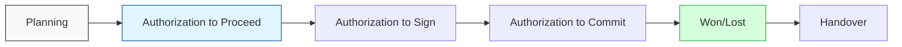
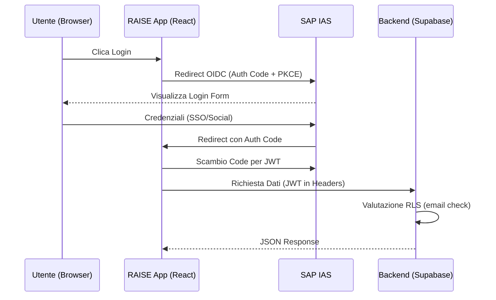
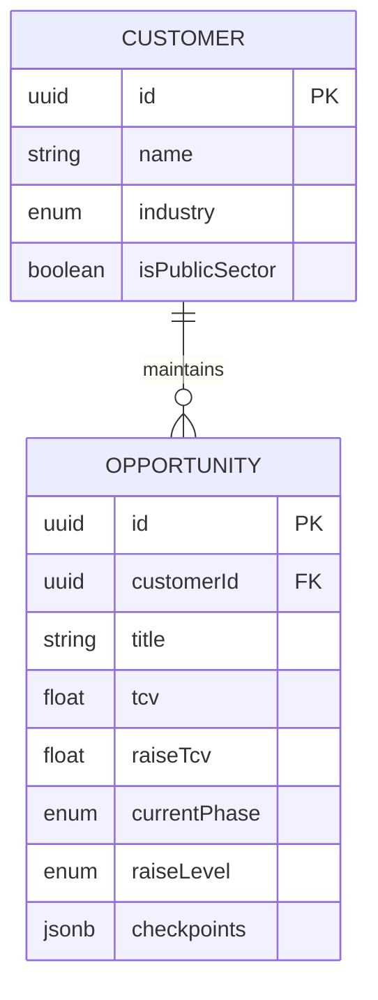

# RAISE App - System Design & Architecture Guide

---
**Documento Tecnico di Riferimento**
- **Sviluppato da:** Lutech Professional Services
- **Compliance:** PSQ-003 v17 Standard
- **Status:** Ultima Revisione 2025-01-01
---

## 1. Visione e Obiettivi

**RAISE** (Risk Assessment & Internal Sales Enablement) è la piattaforma strategica di Lutech progettata per digitalizzare e standardizzare il processo di governance delle opportunità commerciali. 

Il sistema garantisce che ogni trattativa segua un workflow rigoroso di approvazione basato sull'esposizione al rischio e sul valore contrattuale, integrando controlli automatici e checkpoint decisionali.

### Key Objectives
- **Standardizzazione:** Uniformare il processo sales attraverso fasi definite (ATP, ATS, ATC).
- **Governance:** Calcolo automatico dei livelli di autorizzazione (L1-L6).
- **Compliance:** Full audit trail e integrazione con le policy aziendali (KCP).

---

## 2. Architettura Funzionale

Il workflow di un'opportunità attraversa diverse fasi critiche, ognuna con requisiti e checkpoint specifici.

### 2.1. Lifecycle dell'Opportunità



### 2.2. Il Motore RAISE (Business Logic)
Il cuore del sistema è il **calculateRaiseLevel**, che implementa la matrice di autorizzazione PSQ-003 §5.4.

| Fattore di Rischio | Impatto sul Livello |
| :--- | :--- |
| **TCV > 20M€** | Livello L1 (Executive Committee) |
| **Social Clauses** | Spostamento Diretto a L1 |
| **KCP Deviation** | Innalzamento di 1 livello (fino a L4) |
| **New Customer** | Innalzamento di 1 livello (fino a L4) |

---

## 3. Stack Tecnologico

L'applicazione è costruita seguendo i principi di modernità, velocità e type-safety.

- **Core:** [React 19](https://react.dev/) + [TypeScript 5.6](https://www.typescriptlang.org/)
- **Build Tool:** [Vite 7.3](https://vitejs.dev/)
- **State Management:** [Zustand](https://zustand-demo.pmnd.rs/) (Lightweight, logic-focused)
- **Styling:** [Tailwind CSS](https://tailwindcss.com/) + [Lucide React](https://lucide.dev/)
- **Validation:** [Zod](https://zod.dev/) (Schema-first validation)
- **I18n:** [react-i18next](https://react.i18next.com/) (Multi-namespace architecture)

---

## 4. Architettura di Sicurezza

Il framework di sicurezza si basa su un'integrazione a due livelli tra identità enterprise e policy di accesso granulari sui dati.

### 4.1. Flusso di Autenticazione (OIDC + IAS)



### 4.2. Row Level Security (RLS)
Il backend implementa policy RLS per garantire che gli utenti possano visualizzare solo i dati di loro competenza:

```sql
-- Esempio di policy RLS per le opportunità
CREATE POLICY "RAISE_Access_Policy"
ON opportunities FOR ALL
USING (
  created_by_email = current_setting('request.headers')::json->>'x-user-email'
);
```

---

## 5. Modello Dati

Il modello dati è centralizzato su Supabase e strutturato per supportare la migrazione da sistemi legacy verso una gestione relazionale completa.



---

## 6. Sviluppo e Qualità

### 6.1. Strategia di Testing Completa

Il sistema garantisce **Quality Excellence** attraverso una pipeline di testing automatizzata e completa su 3 livelli:

#### Layer 1: Unit Tests (Vitest + React Testing Library)
- **Coverage:** 339 test passing
- **Scope:** Logica di business, calcoli RAISE, validazione form, componenti UI
- **Files:** `src/__tests__/unit/*.test.ts`
- **Execution:** `npm test` (watch mode) / `npx vitest run` (CI)

**Test Critici:**
- Calcolo RAISE Level (TCV + Margin matrix)
- Validazione form con Zod schemas
- State management (Zustand stores)
- Business logic (Fast Track detection, KCP deviations)

#### Layer 2: Integration Tests
- **Coverage:** 8 test passing
- **Scope:** Multi-component workflows, store interactions, persistence (localStorage)
- **Files:** `src/__tests__/integration/*.test.tsx`

**Test Critici:**
- Opportunity workflow (Dashboard ↔ Workflow ↔ Forms)
- Customer-opportunity relationship
- Phase completion transitions
- Settings checkpoint loading

#### Layer 3: End-to-End Tests (Playwright)
- **Framework:** [Playwright](https://playwright.dev/)
- **Cross-Browser:** Chrome, Firefox, Safari (Desktop + Mobile)
- **CI/CD:** GitHub Actions with JUnit XML reporting
- **Files:** `e2e/*.spec.ts`

**Test Scenarios:**
1. **Complete Workflow Lifecycle:**
   - Planning → ATP → ATS → ATC → Won → Handover (regression test)
   - Lost outcome flow
   - Phase skip prevention
2. **Navigation Tests:**
   - Dashboard ↔ New Opportunity ↔ Workflow
   - Sidebar phase navigation
3. **Critical User Journeys:**
   - Create → Edit → Complete opportunity
   - Fast Track workflow (TCV < €250k)
4. **Regression Tests:**
   - Handover completion bug fix (2026-01-01)

**Playwright Configuration:**
```typescript
// playwright.config.ts
projects: [
  { name: 'chromium', use: { ...devices['Desktop Chrome'] } },
  { name: 'firefox', use: { ...devices['Desktop Firefox'] } },
  { name: 'webkit', use: { ...devices['Desktop Safari'] } },
  { name: 'Mobile Chrome', use: { ...devices['Pixel 5'] } },
  { name: 'Mobile Safari', use: { ...devices['iPhone 13'] } }
]
```

### 6.2. CI/CD Pipeline (GitHub Actions)

**Workflow:** `.github/workflows/e2e-tests.yml`

**Triggers:**
- Push to `main` or `develop` branches
- Pull requests targeting `main` or `develop`

**Pipeline Steps:**
1. Install dependencies (`npm ci`)
2. Install Playwright browsers (Chromium, Firefox, WebKit)
3. Run unit tests (`npx vitest run`)
4. Run E2E tests (`npx playwright test`)
5. Upload test results as artifacts
6. Publish JUnit test report

**Results:**
- Test reports visible in GitHub Actions summary
- Screenshots/videos on failure (auto-uploaded)
- JUnit XML for integration with reporting tools

### 6.3. Internazionalizzazione (i18n)

Il sistema `i18n` è architetturato con **6 namespace modulari** per ottimizzare caricamento e manutenibilità:

| Namespace | Scope | Key Features |
|---|---|---|
| `common` | UI generali, navigation, buttons | Shared across all pages |
| `auth` | Authentication flows | SAP IAS login/logout |
| `dashboard` | Dashboard metrics, cards | Pipeline overview |
| `business` | Opportunity forms, validation | TCV, margins, KCP |
| `workflow` | Phase management, checkpoints | ATP, ATS, ATC completion |
| `settings` | Checkpoint configuration | Admin settings |

**Lingua Corrente:** Italiano (IT) completo
**Pianificate:** EN, FR, DE (architettura ready)

Vedi: [I18N_GUIDE.md](I18N_GUIDE.md) per dettagli implementativi.

---

## 7. Gestione Clienti (Customer Management)

### 7.1. Architettura Relazionale

**Versione:** 1.1.0 (Introdotto 2025-12-21)

Il sistema Customer Management introduce un layer relazionale per centralizzare i dati cliente e garantire coerenza tra opportunità.

**Caratteristiche:**
- UUID-based customer IDs
- Industry standardization (10 settori predefiniti)
- Public Sector flag (PA/Ente Pubblico)
- Referential integrity protection
- Backward compatibility con opportunità legacy

### 7.2. Customer → Opportunity Auto-Fill

Quando un cliente viene selezionato nel form opportunità:
1. **Industry** e **Public Sector** vengono **auto-popolati** (readonly)
2. Campi bloccati (icona lucchetto 🔒) per garantire coerenza
3. Modifiche al cliente si propagano a tutte le opportunità collegate

### 7.3. Quick Add Customer (Inline Creation)

Feature UX per creazione cliente **senza uscire dal form opportunità**:
- Pulsante "+" verde accanto al dropdown cliente
- Modal Quick Add Customer
- Cliente creato → auto-selezionato nel dropdown
- Fields auto-filled immediatamente

**Vantaggi:**
- Zero context switching
- Workflow fluido
- Coerenza dati garantita

---

## 8. Deployment Architecture

### 8.1. Production: SAP BTP Kyma (Kubernetes)

**Infrastructure:**
- **Platform:** SAP BTP Kyma Runtime (Managed Kubernetes)
- **Service Mesh:** Istio (automatic sidecar injection)
- **Ingress:** Kyma APIRule v2 (TLS + routing)
- **Container Registry:** GitHub Container Registry (GHCR)

**Namespace:** `raise-app` (isolated with ResourceQuota)

**Architecture:**
```
┌─────────────────────────────────────────┐
│ Istio Ingress Gateway (TLS Termination) │
└─────────────────┬───────────────────────┘
                  │
┌─────────────────▼───────────────────────┐
│ Namespace: raise-app                    │
│   ┌─────────────────────────────────┐   │
│   │ Pod: raise-app                  │   │
│   │  - Container: nginx:8080        │   │
│   │  - Sidecar: istio-proxy         │   │
│   └─────────────────────────────────┘   │
│   ResourceQuota │ NetworkPolicy         │
└─────────────────────────────────────────┘
          │              │
    ┌─────┴────┐   ┌────┴─────┐
    │ SAP IAS  │   │ Supabase │
    │ (Auth)   │   │ (DB)     │
    └──────────┘   └──────────┘
```

**Resource Limits:**
- CPU: 50m (request) / 200m (limit)
- Memory: 64Mi (request) / 128Mi (limit)
- Replicas: 1 (scalable)

**Security:**
- Pod runs as non-root user (1001)
- NetworkPolicy: Ingress only from Istio Gateway
- Content Security Policy (CSP) headers
- PKCE-enabled OIDC flow (no client secret)

### 8.2. CI/CD: GitHub Actions → Kyma

**Workflow:** `.github/workflows/deploy-kyma.yml`

**Pipeline:**
1. Test → Run full test suite (unit + E2E)
2. Build → Multi-stage Docker build with build-time env vars
3. Push → GHCR (ghcr.io/YOUR_ORG/raise-app:latest)
4. Deploy → `kubectl apply -k k8s/` via kubeconfig secret

**Runtime Configuration:**
- Environment variables **baked at build time** (Vite bundler)
- Secrets injected via GitHub Secrets (never hardcoded)

Vedi: [KYMA_DEPLOYMENT.md](KYMA_DEPLOYMENT.md) per setup completo.

---

## 9. Workflow Terminal States

### 9.1. Handover Phase (Final State)

**Fix Critico:** 2026-01-01 (Commit: `54d66f8`)

**Problema Risolto:**
- Clicking "Completa Handover" non faceva nulla
- Mancava handler per stato terminale

**Soluzione:**
```typescript
// src/components/workflow/index.tsx
if (phase === 'Handover') {
    showToast.success(t('completion.success') + ' - Workflow completato!');
    return; // Terminal state - no next phase
}
```

**Stati Terminali:**
1. **Won → Handover** - Opportunità vinta e consegnata
2. **Lost** - Opportunità persa (archiviata)
3. **Handover Completato** - Workflow finale completato

**Test Coverage:**
- E2E regression test in `e2e/workflow-completion.spec.ts`
- Verifica messaggio "Workflow completato!" appare
- Verifica opportunità rimane in stato Handover

---

**Fine Documento**
"Precision, Compliance, Excellence."

**Ultima Revisione:** 2026-01-01
**Test Coverage:** 339 unit + 8 integration + E2E multi-browser
**Quality Gate:** ✅ 100% Pass Rate
