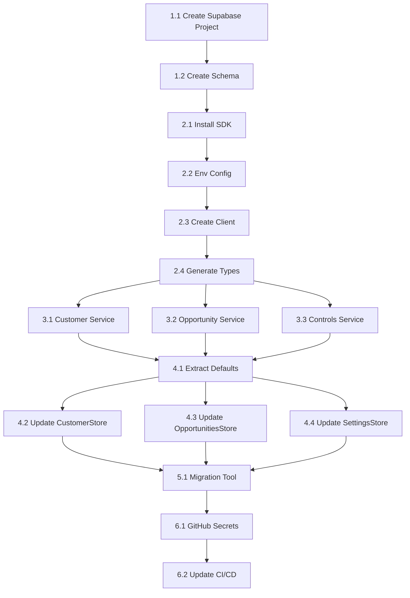

# Supabase Backend Integration - Implementation Plan

> **For Claude:** REQUIRED SUB-SKILL: Use superpowers:executing-plans to implement this plan task-by-task.

**Goal:** Migrate RAISE app from localStorage to Supabase PostgreSQL backend for persistent, cross-device data storage.

**Architecture:** Create Supabase project with PostgreSQL tables for customers, opportunities, controls, and checkpoints. Implement a service layer that abstracts database operations, allowing stores to switch between localStorage (offline) and Supabase (online). Row Level Security (RLS) disabled initially, will be enabled with authentication later.

**Tech Stack:** Supabase (PostgreSQL), @supabase/supabase-js, React Context (existing stores), TypeScript

---

## Phase 1: Supabase Project Setup (Manual)

### Task 1.1: Create Supabase Project

**This is a manual step - no code changes**

**Steps:**
1. Go to https://supabase.com and sign up/login
2. Click "New Project"
3. Fill in:
   - **Name:** `raise-app`
   - **Database Password:** Generate strong password (save it!)
   - **Region:** Select closest (eu-central-1 for Italy)
4. Wait for project to provision (~2 minutes)
5. Go to Settings → API and note:
   - **Project URL:** `https://xxxxx.supabase.co`
   - **anon public key:** `eyJhbGci...`

**Verification:** Project dashboard accessible at supabase.com

---

### Task 1.2: Create Database Schema

**Location:** Supabase Dashboard → SQL Editor

**Step 1: Run this SQL to create all tables**

```sql
-- Enable UUID extension
CREATE EXTENSION IF NOT EXISTS "uuid-ossp";

-- ============================================================================
-- CUSTOMERS TABLE
-- ============================================================================
CREATE TABLE customers (
    id UUID PRIMARY KEY DEFAULT uuid_generate_v4(),
    name VARCHAR(200) NOT NULL CHECK (char_length(name) >= 2),
    industry VARCHAR(50) NOT NULL,
    is_public_sector BOOLEAN NOT NULL DEFAULT false,
    created_at TIMESTAMPTZ NOT NULL DEFAULT NOW(),
    updated_at TIMESTAMPTZ NOT NULL DEFAULT NOW()
);

-- Index for faster lookups
CREATE INDEX idx_customers_name ON customers(name);

-- ============================================================================
-- OPPORTUNITIES TABLE
-- ============================================================================
CREATE TABLE opportunities (
    id VARCHAR(50) PRIMARY KEY, -- OPP-YYYY-XXX format
    title VARCHAR(200) NOT NULL,
    customer_id UUID REFERENCES customers(id) ON DELETE SET NULL,

    -- Legacy fields (for backward compatibility)
    client_name VARCHAR(200),
    industry VARCHAR(50),

    -- Financial
    tcv NUMERIC(15,2) NOT NULL DEFAULT 0,
    raise_tcv NUMERIC(15,2) NOT NULL DEFAULT 0,
    margin_percent NUMERIC(5,2),
    first_margin_percent NUMERIC(5,2),
    cash_flow_neutral BOOLEAN DEFAULT false,
    services_value NUMERIC(15,2),

    -- Phase
    current_phase VARCHAR(20) NOT NULL DEFAULT 'Planning',

    -- Flags
    has_kcp_deviations BOOLEAN NOT NULL DEFAULT false,
    is_fast_track BOOLEAN NOT NULL DEFAULT false,
    is_rti BOOLEAN NOT NULL DEFAULT false,
    is_mandataria BOOLEAN,
    is_public_sector BOOLEAN NOT NULL DEFAULT false,
    has_social_clauses BOOLEAN DEFAULT false,
    is_non_core_business BOOLEAN DEFAULT false,
    has_low_risk_services BOOLEAN DEFAULT false,
    is_small_ticket BOOLEAN DEFAULT false,
    is_new_customer BOOLEAN DEFAULT false,
    is_child BOOLEAN DEFAULT false,

    -- Supplier management
    has_suppliers BOOLEAN DEFAULT false,
    supplier_alignment VARCHAR(30),

    -- Calculated
    raise_level VARCHAR(5) NOT NULL DEFAULT 'L6',

    -- Privacy
    privacy_risk_level VARCHAR(20),

    -- Dates
    offer_date DATE,
    contract_date DATE,
    order_date DATE,
    ats_date DATE,
    atc_date DATE,
    rcp_date DATE,

    -- Metadata
    created_at TIMESTAMPTZ NOT NULL DEFAULT NOW(),
    updated_at TIMESTAMPTZ NOT NULL DEFAULT NOW()
);

-- Indexes
CREATE INDEX idx_opportunities_customer ON opportunities(customer_id);
CREATE INDEX idx_opportunities_phase ON opportunities(current_phase);
CREATE INDEX idx_opportunities_level ON opportunities(raise_level);

-- ============================================================================
-- KCP DEVIATIONS TABLE (normalized from opportunity.deviations array)
-- ============================================================================
CREATE TABLE kcp_deviations (
    id UUID PRIMARY KEY DEFAULT uuid_generate_v4(),
    opportunity_id VARCHAR(50) NOT NULL REFERENCES opportunities(id) ON DELETE CASCADE,
    type VARCHAR(30) NOT NULL,
    description TEXT NOT NULL,
    expert_opinion VARCHAR(10),
    expert_name VARCHAR(100),
    created_at TIMESTAMPTZ NOT NULL DEFAULT NOW()
);

CREATE INDEX idx_deviations_opportunity ON kcp_deviations(opportunity_id);

-- ============================================================================
-- CONTROLS TABLE (workflow checkpoints configuration)
-- ============================================================================
CREATE TABLE controls (
    id VARCHAR(100) PRIMARY KEY,
    label VARCHAR(200) NOT NULL,
    description TEXT,
    phase VARCHAR(20) NOT NULL,
    sort_order INTEGER DEFAULT 0,
    is_mandatory BOOLEAN NOT NULL DEFAULT true,
    action_type VARCHAR(20) DEFAULT 'task',
    condition TEXT,
    detailed_description TEXT,
    folder_path VARCHAR(500),
    mandatory_notes TEXT,
    template_ref VARCHAR(500),
    created_at TIMESTAMPTZ NOT NULL DEFAULT NOW(),
    updated_at TIMESTAMPTZ NOT NULL DEFAULT NOW()
);

CREATE INDEX idx_controls_phase ON controls(phase);

-- ============================================================================
-- CONTROL TEMPLATE LINKS TABLE (for multiple templates per control)
-- ============================================================================
CREATE TABLE control_template_links (
    id UUID PRIMARY KEY DEFAULT uuid_generate_v4(),
    control_id VARCHAR(100) NOT NULL REFERENCES controls(id) ON DELETE CASCADE,
    name VARCHAR(200) NOT NULL,
    url TEXT NOT NULL,
    sort_order INTEGER DEFAULT 0
);

CREATE INDEX idx_template_links_control ON control_template_links(control_id);

-- ============================================================================
-- OPPORTUNITY CHECKPOINTS TABLE (tracks completion per opportunity)
-- ============================================================================
CREATE TABLE opportunity_checkpoints (
    id UUID PRIMARY KEY DEFAULT uuid_generate_v4(),
    opportunity_id VARCHAR(50) NOT NULL REFERENCES opportunities(id) ON DELETE CASCADE,
    control_id VARCHAR(100) NOT NULL REFERENCES controls(id) ON DELETE CASCADE,
    phase VARCHAR(20) NOT NULL,
    is_completed BOOLEAN NOT NULL DEFAULT false,
    completed_at TIMESTAMPTZ,
    completed_by VARCHAR(200),
    notes TEXT,
    created_at TIMESTAMPTZ NOT NULL DEFAULT NOW(),
    updated_at TIMESTAMPTZ NOT NULL DEFAULT NOW(),

    UNIQUE(opportunity_id, control_id)
);

CREATE INDEX idx_checkpoints_opportunity ON opportunity_checkpoints(opportunity_id);
CREATE INDEX idx_checkpoints_control ON opportunity_checkpoints(control_id);

-- ============================================================================
-- UPDATED_AT TRIGGER (auto-update timestamp)
-- ============================================================================
CREATE OR REPLACE FUNCTION update_updated_at_column()
RETURNS TRIGGER AS $$
BEGIN
    NEW.updated_at = NOW();
    RETURN NEW;
END;
$$ language 'plpgsql';

CREATE TRIGGER update_customers_updated_at
    BEFORE UPDATE ON customers
    FOR EACH ROW EXECUTE FUNCTION update_updated_at_column();

CREATE TRIGGER update_opportunities_updated_at
    BEFORE UPDATE ON opportunities
    FOR EACH ROW EXECUTE FUNCTION update_updated_at_column();

CREATE TRIGGER update_controls_updated_at
    BEFORE UPDATE ON controls
    FOR EACH ROW EXECUTE FUNCTION update_updated_at_column();

CREATE TRIGGER update_checkpoints_updated_at
    BEFORE UPDATE ON opportunity_checkpoints
    FOR EACH ROW EXECUTE FUNCTION update_updated_at_column();
```

**Step 2: Verify tables created**

Run in SQL Editor:
```sql
SELECT table_name FROM information_schema.tables WHERE table_schema = 'public';
```

Expected: 6 tables (customers, opportunities, kcp_deviations, controls, control_template_links, opportunity_checkpoints)

---

## Phase 2: Supabase Client Setup

### Task 2.1: Install Supabase SDK

**Files:**
- Modify: `package.json`

**Step 1: Install dependency**

```bash
npm install @supabase/supabase-js
```

**Step 2: Verify installation**

```bash
npm ls @supabase/supabase-js
```

Expected: `@supabase/supabase-js@2.x.x`

**Step 3: Commit**

```bash
git add package.json package-lock.json
git commit -m "chore: add supabase-js dependency"
```

---

### Task 2.2: Create Environment Configuration

**Files:**
- Create: `.env.local`
- Create: `.env.example`
- Modify: `.gitignore`

**Step 1: Create .env.example (committed to repo)**

```bash
# .env.example
VITE_SUPABASE_URL=https://your-project.supabase.co
VITE_SUPABASE_ANON_KEY=your-anon-key-here
```

**Step 2: Create .env.local (NOT committed)**

```bash
# .env.local - Replace with actual values from Supabase dashboard
VITE_SUPABASE_URL=https://xxxxx.supabase.co
VITE_SUPABASE_ANON_KEY=eyJhbGciOiJIUzI1NiIsInR5cCI6IkpXVCJ9...
```

**Step 3: Update .gitignore**

Add to `.gitignore`:
```
# Environment files
.env.local
.env.*.local
```

**Step 4: Commit**

```bash
git add .env.example .gitignore
git commit -m "chore: add supabase environment configuration"
```

---

### Task 2.3: Create Supabase Client

**Files:**
- Create: `src/lib/supabase.ts`

**Step 1: Create the client file**

```typescript
// src/lib/supabase.ts
import { createClient } from '@supabase/supabase-js';
import type { Database } from './database.types';

const supabaseUrl = import.meta.env.VITE_SUPABASE_URL;
const supabaseAnonKey = import.meta.env.VITE_SUPABASE_ANON_KEY;

if (!supabaseUrl || !supabaseAnonKey) {
    console.warn('Supabase credentials not configured. Using localStorage fallback.');
}

export const supabase = supabaseUrl && supabaseAnonKey
    ? createClient<Database>(supabaseUrl, supabaseAnonKey, {
        auth: {
            persistSession: false, // No auth for now
        },
    })
    : null;

export const isSupabaseConfigured = (): boolean => {
    return supabase !== null;
};
```

**Step 2: Commit**

```bash
git add src/lib/supabase.ts
git commit -m "feat: create supabase client with fallback support"
```

---

### Task 2.4: Generate TypeScript Types

**Files:**
- Create: `src/lib/database.types.ts`

**Step 1: Create database types**

```typescript
// src/lib/database.types.ts
// Generated types for Supabase tables

export interface Database {
    public: {
        Tables: {
            customers: {
                Row: {
                    id: string;
                    name: string;
                    industry: string;
                    is_public_sector: boolean;
                    created_at: string;
                    updated_at: string;
                };
                Insert: {
                    id?: string;
                    name: string;
                    industry: string;
                    is_public_sector?: boolean;
                    created_at?: string;
                    updated_at?: string;
                };
                Update: {
                    id?: string;
                    name?: string;
                    industry?: string;
                    is_public_sector?: boolean;
                    updated_at?: string;
                };
            };
            opportunities: {
                Row: {
                    id: string;
                    title: string;
                    customer_id: string | null;
                    client_name: string | null;
                    industry: string | null;
                    tcv: number;
                    raise_tcv: number;
                    margin_percent: number | null;
                    first_margin_percent: number | null;
                    cash_flow_neutral: boolean | null;
                    services_value: number | null;
                    current_phase: string;
                    has_kcp_deviations: boolean;
                    is_fast_track: boolean;
                    is_rti: boolean;
                    is_mandataria: boolean | null;
                    is_public_sector: boolean;
                    has_social_clauses: boolean | null;
                    is_non_core_business: boolean | null;
                    has_low_risk_services: boolean | null;
                    is_small_ticket: boolean | null;
                    is_new_customer: boolean | null;
                    is_child: boolean | null;
                    has_suppliers: boolean | null;
                    supplier_alignment: string | null;
                    raise_level: string;
                    privacy_risk_level: string | null;
                    offer_date: string | null;
                    contract_date: string | null;
                    order_date: string | null;
                    ats_date: string | null;
                    atc_date: string | null;
                    rcp_date: string | null;
                    created_at: string;
                    updated_at: string;
                };
                Insert: Omit<Database['public']['Tables']['opportunities']['Row'], 'created_at' | 'updated_at'> & {
                    created_at?: string;
                    updated_at?: string;
                };
                Update: Partial<Database['public']['Tables']['opportunities']['Insert']>;
            };
            controls: {
                Row: {
                    id: string;
                    label: string;
                    description: string | null;
                    phase: string;
                    sort_order: number | null;
                    is_mandatory: boolean;
                    action_type: string | null;
                    condition: string | null;
                    detailed_description: string | null;
                    folder_path: string | null;
                    mandatory_notes: string | null;
                    template_ref: string | null;
                    created_at: string;
                    updated_at: string;
                };
                Insert: Omit<Database['public']['Tables']['controls']['Row'], 'created_at' | 'updated_at'>;
                Update: Partial<Database['public']['Tables']['controls']['Insert']>;
            };
            kcp_deviations: {
                Row: {
                    id: string;
                    opportunity_id: string;
                    type: string;
                    description: string;
                    expert_opinion: string | null;
                    expert_name: string | null;
                    created_at: string;
                };
                Insert: Omit<Database['public']['Tables']['kcp_deviations']['Row'], 'id' | 'created_at'>;
                Update: Partial<Database['public']['Tables']['kcp_deviations']['Insert']>;
            };
            opportunity_checkpoints: {
                Row: {
                    id: string;
                    opportunity_id: string;
                    control_id: string;
                    phase: string;
                    is_completed: boolean;
                    completed_at: string | null;
                    completed_by: string | null;
                    notes: string | null;
                    created_at: string;
                    updated_at: string;
                };
                Insert: Omit<Database['public']['Tables']['opportunity_checkpoints']['Row'], 'id' | 'created_at' | 'updated_at'>;
                Update: Partial<Database['public']['Tables']['opportunity_checkpoints']['Insert']>;
            };
            control_template_links: {
                Row: {
                    id: string;
                    control_id: string;
                    name: string;
                    url: string;
                    sort_order: number | null;
                };
                Insert: Omit<Database['public']['Tables']['control_template_links']['Row'], 'id'>;
                Update: Partial<Database['public']['Tables']['control_template_links']['Insert']>;
            };
        };
    };
}
```

**Step 2: Commit**

```bash
git add src/lib/database.types.ts
git commit -m "feat: add supabase database types"
```

---

## Phase 3: Service Layer

### Task 3.1: Create Customer Service

**Files:**
- Create: `src/services/customerService.ts`
- Test: `src/services/customerService.test.ts`

**Step 1: Write the test**

```typescript
// src/services/customerService.test.ts
import { describe, it, expect, vi, beforeEach } from 'vitest';
import { customerService } from './customerService';
import type { Customer } from '../types';

// Mock supabase
vi.mock('../lib/supabase', () => ({
    supabase: null, // Test localStorage fallback
    isSupabaseConfigured: () => false,
}));

describe('customerService', () => {
    beforeEach(() => {
        localStorage.clear();
    });

    it('should return empty array when no customers exist', async () => {
        const customers = await customerService.getAll();
        expect(customers).toEqual([]);
    });

    it('should create and retrieve a customer', async () => {
        const newCustomer: Omit<Customer, 'id'> = {
            name: 'Test Company',
            industry: 'Technology',
            isPublicSector: false,
        };

        const created = await customerService.create(newCustomer);
        expect(created.id).toBeDefined();
        expect(created.name).toBe('Test Company');

        const all = await customerService.getAll();
        expect(all).toHaveLength(1);
    });

    it('should update a customer', async () => {
        const created = await customerService.create({
            name: 'Original',
            industry: 'Finance',
            isPublicSector: false,
        });

        const updated = await customerService.update({
            ...created,
            name: 'Updated',
        });

        expect(updated.name).toBe('Updated');
    });

    it('should delete a customer', async () => {
        const created = await customerService.create({
            name: 'To Delete',
            industry: 'Retail',
            isPublicSector: false,
        });

        await customerService.delete(created.id);
        const all = await customerService.getAll();
        expect(all).toHaveLength(0);
    });
});
```

**Step 2: Run test to verify it fails**

```bash
npx vitest run src/services/customerService.test.ts
```

Expected: FAIL - module not found

**Step 3: Create the service**

```typescript
// src/services/customerService.ts
import { supabase, isSupabaseConfigured } from '../lib/supabase';
import type { Customer } from '../types';

const STORAGE_KEY = 'raise_customers';

// Helper to convert DB row to Customer type
const rowToCustomer = (row: {
    id: string;
    name: string;
    industry: string;
    is_public_sector: boolean;
}): Customer => ({
    id: row.id,
    name: row.name,
    industry: row.industry as Customer['industry'],
    isPublicSector: row.is_public_sector,
});

// Helper to convert Customer to DB row
const customerToRow = (customer: Customer) => ({
    id: customer.id,
    name: customer.name,
    industry: customer.industry,
    is_public_sector: customer.isPublicSector,
});

// localStorage fallback implementation
const localStorageService = {
    getAll: async (): Promise<Customer[]> => {
        const data = localStorage.getItem(STORAGE_KEY);
        return data ? JSON.parse(data) : [];
    },

    getById: async (id: string): Promise<Customer | null> => {
        const all = await localStorageService.getAll();
        return all.find(c => c.id === id) || null;
    },

    create: async (customer: Omit<Customer, 'id'>): Promise<Customer> => {
        const all = await localStorageService.getAll();
        const newCustomer: Customer = {
            ...customer,
            id: crypto.randomUUID(),
        };
        all.push(newCustomer);
        localStorage.setItem(STORAGE_KEY, JSON.stringify(all));
        return newCustomer;
    },

    update: async (customer: Customer): Promise<Customer> => {
        const all = await localStorageService.getAll();
        const index = all.findIndex(c => c.id === customer.id);
        if (index === -1) throw new Error('Customer not found');
        all[index] = customer;
        localStorage.setItem(STORAGE_KEY, JSON.stringify(all));
        return customer;
    },

    delete: async (id: string): Promise<void> => {
        const all = await localStorageService.getAll();
        const filtered = all.filter(c => c.id !== id);
        localStorage.setItem(STORAGE_KEY, JSON.stringify(filtered));
    },
};

// Supabase implementation
const supabaseService = {
    getAll: async (): Promise<Customer[]> => {
        const { data, error } = await supabase!
            .from('customers')
            .select('*')
            .order('name');

        if (error) throw error;
        return (data || []).map(rowToCustomer);
    },

    getById: async (id: string): Promise<Customer | null> => {
        const { data, error } = await supabase!
            .from('customers')
            .select('*')
            .eq('id', id)
            .single();

        if (error) {
            if (error.code === 'PGRST116') return null; // Not found
            throw error;
        }
        return data ? rowToCustomer(data) : null;
    },

    create: async (customer: Omit<Customer, 'id'>): Promise<Customer> => {
        const { data, error } = await supabase!
            .from('customers')
            .insert(customerToRow({ ...customer, id: crypto.randomUUID() }))
            .select()
            .single();

        if (error) throw error;
        return rowToCustomer(data);
    },

    update: async (customer: Customer): Promise<Customer> => {
        const { data, error } = await supabase!
            .from('customers')
            .update(customerToRow(customer))
            .eq('id', customer.id)
            .select()
            .single();

        if (error) throw error;
        return rowToCustomer(data);
    },

    delete: async (id: string): Promise<void> => {
        const { error } = await supabase!
            .from('customers')
            .delete()
            .eq('id', id);

        if (error) throw error;
    },
};

// Export the appropriate service based on configuration
export const customerService = isSupabaseConfigured()
    ? supabaseService
    : localStorageService;
```

**Step 4: Run test to verify it passes**

```bash
npx vitest run src/services/customerService.test.ts
```

Expected: PASS

**Step 5: Commit**

```bash
git add src/services/customerService.ts src/services/customerService.test.ts
git commit -m "feat: add customer service with supabase/localStorage abstraction"
```

---

### Task 3.2: Create Opportunity Service

**Files:**
- Create: `src/services/opportunityService.ts`
- Test: `src/services/opportunityService.test.ts`

**Step 1: Write the test**

```typescript
// src/services/opportunityService.test.ts
import { describe, it, expect, vi, beforeEach } from 'vitest';
import { opportunityService } from './opportunityService';
import type { Opportunity } from '../types';

vi.mock('../lib/supabase', () => ({
    supabase: null,
    isSupabaseConfigured: () => false,
}));

const createTestOpportunity = (overrides: Partial<Opportunity> = {}): Omit<Opportunity, 'id'> => ({
    title: 'Test Opportunity',
    customerId: 'cust-123',
    tcv: 500000,
    raiseTcv: 500000,
    currentPhase: 'Planning',
    hasKcpDeviations: false,
    isFastTrack: false,
    isRti: false,
    isPublicSector: false,
    raiseLevel: 'L4',
    deviations: [],
    checkpoints: {},
    ...overrides,
});

describe('opportunityService', () => {
    beforeEach(() => {
        localStorage.clear();
    });

    it('should return empty array when no opportunities exist', async () => {
        const opportunities = await opportunityService.getAll();
        expect(opportunities).toEqual([]);
    });

    it('should create and retrieve an opportunity', async () => {
        const newOpp = createTestOpportunity({ title: 'New Deal' });
        const created = await opportunityService.create(newOpp);

        expect(created.id).toBeDefined();
        expect(created.id).toMatch(/^OPP-/);
        expect(created.title).toBe('New Deal');
    });

    it('should update an opportunity', async () => {
        const created = await opportunityService.create(createTestOpportunity());
        const updated = await opportunityService.update({
            ...created,
            title: 'Updated Title',
        });

        expect(updated.title).toBe('Updated Title');
    });

    it('should delete an opportunity', async () => {
        const created = await opportunityService.create(createTestOpportunity());
        await opportunityService.delete(created.id);
        const all = await opportunityService.getAll();
        expect(all).toHaveLength(0);
    });
});
```

**Step 2: Run test to verify it fails**

```bash
npx vitest run src/services/opportunityService.test.ts
```

Expected: FAIL

**Step 3: Create the service**

```typescript
// src/services/opportunityService.ts
import { supabase, isSupabaseConfigured } from '../lib/supabase';
import type { Opportunity, KcpDeviation, Checkpoint } from '../types';
import { calculateRaiseLevel } from '../lib/raiseLogic';

const STORAGE_KEY = 'raise_opportunities';

// Generate opportunity ID
const generateOpportunityId = (): string => {
    const year = new Date().getFullYear();
    const random = Math.floor(Math.random() * 10000).toString().padStart(4, '0');
    return `OPP-${year}-${random}`;
};

// localStorage implementation
const localStorageService = {
    getAll: async (): Promise<Opportunity[]> => {
        const data = localStorage.getItem(STORAGE_KEY);
        if (!data) return [];
        const parsed = JSON.parse(data);
        return parsed.map((opp: Opportunity) => ({
            ...opp,
            raiseLevel: calculateRaiseLevel(opp),
        }));
    },

    getById: async (id: string): Promise<Opportunity | null> => {
        const all = await localStorageService.getAll();
        return all.find(o => o.id === id) || null;
    },

    create: async (opportunity: Omit<Opportunity, 'id'>): Promise<Opportunity> => {
        const all = await localStorageService.getAll();
        const newOpp: Opportunity = {
            ...opportunity,
            id: generateOpportunityId(),
            raiseLevel: calculateRaiseLevel(opportunity as Opportunity),
        };
        all.push(newOpp);
        localStorage.setItem(STORAGE_KEY, JSON.stringify(all));
        return newOpp;
    },

    update: async (opportunity: Opportunity): Promise<Opportunity> => {
        const all = await localStorageService.getAll();
        const index = all.findIndex(o => o.id === opportunity.id);
        if (index === -1) throw new Error('Opportunity not found');
        const updated = {
            ...opportunity,
            raiseLevel: calculateRaiseLevel(opportunity),
        };
        all[index] = updated;
        localStorage.setItem(STORAGE_KEY, JSON.stringify(all));
        return updated;
    },

    delete: async (id: string): Promise<void> => {
        const all = await localStorageService.getAll();
        const filtered = all.filter(o => o.id !== id);
        localStorage.setItem(STORAGE_KEY, JSON.stringify(filtered));
    },
};

// Supabase implementation (to be expanded)
const supabaseService = {
    getAll: async (): Promise<Opportunity[]> => {
        const { data, error } = await supabase!
            .from('opportunities')
            .select(`
                *,
                kcp_deviations (*),
                opportunity_checkpoints (*)
            `)
            .order('created_at', { ascending: false });

        if (error) throw error;
        return (data || []).map(row => rowToOpportunity(row));
    },

    getById: async (id: string): Promise<Opportunity | null> => {
        const { data, error } = await supabase!
            .from('opportunities')
            .select(`
                *,
                kcp_deviations (*),
                opportunity_checkpoints (*)
            `)
            .eq('id', id)
            .single();

        if (error) {
            if (error.code === 'PGRST116') return null;
            throw error;
        }
        return data ? rowToOpportunity(data) : null;
    },

    create: async (opportunity: Omit<Opportunity, 'id'>): Promise<Opportunity> => {
        const id = generateOpportunityId();
        const oppData = opportunityToRow({ ...opportunity, id } as Opportunity);

        const { data, error } = await supabase!
            .from('opportunities')
            .insert(oppData)
            .select()
            .single();

        if (error) throw error;

        // Insert deviations if any
        if (opportunity.deviations?.length) {
            await supabase!.from('kcp_deviations').insert(
                opportunity.deviations.map(d => ({
                    opportunity_id: id,
                    type: d.type,
                    description: d.description,
                    expert_opinion: d.expertOpinion,
                    expert_name: d.expertName,
                }))
            );
        }

        return { ...rowToOpportunity(data), deviations: opportunity.deviations || [] };
    },

    update: async (opportunity: Opportunity): Promise<Opportunity> => {
        const oppData = opportunityToRow(opportunity);

        const { data, error } = await supabase!
            .from('opportunities')
            .update(oppData)
            .eq('id', opportunity.id)
            .select()
            .single();

        if (error) throw error;

        // Update deviations (delete all and re-insert)
        await supabase!.from('kcp_deviations').delete().eq('opportunity_id', opportunity.id);
        if (opportunity.deviations?.length) {
            await supabase!.from('kcp_deviations').insert(
                opportunity.deviations.map(d => ({
                    opportunity_id: opportunity.id,
                    type: d.type,
                    description: d.description,
                    expert_opinion: d.expertOpinion,
                    expert_name: d.expertName,
                }))
            );
        }

        return { ...rowToOpportunity(data), deviations: opportunity.deviations || [] };
    },

    delete: async (id: string): Promise<void> => {
        const { error } = await supabase!
            .from('opportunities')
            .delete()
            .eq('id', id);

        if (error) throw error;
    },
};

// Helper functions for row conversion
function rowToOpportunity(row: Record<string, unknown>): Opportunity {
    return {
        id: row.id as string,
        title: row.title as string,
        customerId: row.customer_id as string,
        clientName: row.client_name as string,
        industry: row.industry as string,
        tcv: Number(row.tcv),
        raiseTcv: Number(row.raise_tcv),
        marginPercent: row.margin_percent ? Number(row.margin_percent) : undefined,
        firstMarginPercent: row.first_margin_percent ? Number(row.first_margin_percent) : undefined,
        cashFlowNeutral: Boolean(row.cash_flow_neutral),
        servicesValue: row.services_value ? Number(row.services_value) : undefined,
        currentPhase: row.current_phase as Opportunity['currentPhase'],
        hasKcpDeviations: Boolean(row.has_kcp_deviations),
        isFastTrack: Boolean(row.is_fast_track),
        isRti: Boolean(row.is_rti),
        isMandataria: row.is_mandataria as boolean | undefined,
        isPublicSector: Boolean(row.is_public_sector),
        hasSocialClauses: row.has_social_clauses as boolean | undefined,
        isNonCoreBusiness: row.is_non_core_business as boolean | undefined,
        hasLowRiskServices: row.has_low_risk_services as boolean | undefined,
        isSmallTicket: row.is_small_ticket as boolean | undefined,
        isNewCustomer: row.is_new_customer as boolean | undefined,
        isChild: row.is_child as boolean | undefined,
        hasSuppliers: row.has_suppliers as boolean | undefined,
        supplierAlignment: row.supplier_alignment as Opportunity['supplierAlignment'],
        raiseLevel: row.raise_level as Opportunity['raiseLevel'],
        privacyRiskLevel: row.privacy_risk_level as Opportunity['privacyRiskLevel'],
        offerDate: row.offer_date as string | undefined,
        contractDate: row.contract_date as string | undefined,
        orderDate: row.order_date as string | undefined,
        atsDate: row.ats_date as string | undefined,
        atcDate: row.atc_date as string | undefined,
        rcpDate: row.rcp_date as string | undefined,
        deviations: ((row.kcp_deviations as Array<Record<string, unknown>>) || []).map(d => ({
            id: d.id as string,
            type: d.type as KcpDeviation['type'],
            description: d.description as string,
            expertOpinion: d.expert_opinion as KcpDeviation['expertOpinion'],
            expertName: d.expert_name as string | undefined,
        })),
        checkpoints: {}, // Will be populated from opportunity_checkpoints
    };
}

function opportunityToRow(opp: Opportunity): Record<string, unknown> {
    return {
        id: opp.id,
        title: opp.title,
        customer_id: opp.customerId || null,
        client_name: opp.clientName || null,
        industry: opp.industry || null,
        tcv: opp.tcv,
        raise_tcv: opp.raiseTcv,
        margin_percent: opp.marginPercent || null,
        first_margin_percent: opp.firstMarginPercent || null,
        cash_flow_neutral: opp.cashFlowNeutral || false,
        services_value: opp.servicesValue || null,
        current_phase: opp.currentPhase,
        has_kcp_deviations: opp.hasKcpDeviations,
        is_fast_track: opp.isFastTrack,
        is_rti: opp.isRti,
        is_mandataria: opp.isMandataria || null,
        is_public_sector: opp.isPublicSector,
        has_social_clauses: opp.hasSocialClauses || null,
        is_non_core_business: opp.isNonCoreBusiness || null,
        has_low_risk_services: opp.hasLowRiskServices || null,
        is_small_ticket: opp.isSmallTicket || null,
        is_new_customer: opp.isNewCustomer || null,
        is_child: opp.isChild || null,
        has_suppliers: opp.hasSuppliers || null,
        supplier_alignment: opp.supplierAlignment || null,
        raise_level: opp.raiseLevel,
        privacy_risk_level: opp.privacyRiskLevel || null,
        offer_date: opp.offerDate || null,
        contract_date: opp.contractDate || null,
        order_date: opp.orderDate || null,
        ats_date: opp.atsDate || null,
        atc_date: opp.atcDate || null,
        rcp_date: opp.rcpDate || null,
    };
}

export const opportunityService = isSupabaseConfigured()
    ? supabaseService
    : localStorageService;
```

**Step 4: Run test to verify it passes**

```bash
npx vitest run src/services/opportunityService.test.ts
```

Expected: PASS

**Step 5: Commit**

```bash
git add src/services/opportunityService.ts src/services/opportunityService.test.ts
git commit -m "feat: add opportunity service with supabase/localStorage abstraction"
```

---

### Task 3.3: Create Controls Service

**Files:**
- Create: `src/services/controlsService.ts`
- Test: `src/services/controlsService.test.ts`

**Step 1: Write test (similar pattern to above)**

```typescript
// src/services/controlsService.test.ts
import { describe, it, expect, vi, beforeEach } from 'vitest';
import { controlsService } from './controlsService';
import type { ControlConfig } from '../types';

vi.mock('../lib/supabase', () => ({
    supabase: null,
    isSupabaseConfigured: () => false,
}));

describe('controlsService', () => {
    beforeEach(() => {
        localStorage.clear();
    });

    it('should return default controls when no custom controls exist', async () => {
        const controls = await controlsService.getAll();
        expect(controls.length).toBeGreaterThan(0);
    });

    it('should add a new control', async () => {
        const newControl: ControlConfig = {
            id: 'custom-test',
            label: 'Test Control',
            description: 'Test description',
            phase: 'ATP',
            isMandatory: true,
        };

        await controlsService.create(newControl);
        const all = await controlsService.getAll();
        expect(all.find(c => c.id === 'custom-test')).toBeDefined();
    });
});
```

**Step 2: Create the service (similar pattern)**

```typescript
// src/services/controlsService.ts
import { supabase, isSupabaseConfigured } from '../lib/supabase';
import type { ControlConfig } from '../types';
import { DEFAULT_CONTROLS } from '../stores/defaultControls';

const STORAGE_KEY = 'raise_controls';

const localStorageService = {
    getAll: async (): Promise<ControlConfig[]> => {
        const data = localStorage.getItem(STORAGE_KEY);
        return data ? JSON.parse(data) : DEFAULT_CONTROLS;
    },

    create: async (control: ControlConfig): Promise<ControlConfig> => {
        const all = await localStorageService.getAll();
        all.push(control);
        localStorage.setItem(STORAGE_KEY, JSON.stringify(all));
        return control;
    },

    update: async (control: ControlConfig): Promise<ControlConfig> => {
        const all = await localStorageService.getAll();
        const index = all.findIndex(c => c.id === control.id);
        if (index === -1) throw new Error('Control not found');
        all[index] = control;
        localStorage.setItem(STORAGE_KEY, JSON.stringify(all));
        return control;
    },

    delete: async (id: string): Promise<void> => {
        const all = await localStorageService.getAll();
        const filtered = all.filter(c => c.id !== id);
        localStorage.setItem(STORAGE_KEY, JSON.stringify(filtered));
    },

    resetDefaults: async (): Promise<ControlConfig[]> => {
        localStorage.setItem(STORAGE_KEY, JSON.stringify(DEFAULT_CONTROLS));
        return DEFAULT_CONTROLS;
    },
};

const supabaseService = {
    getAll: async (): Promise<ControlConfig[]> => {
        const { data, error } = await supabase!
            .from('controls')
            .select(`
                *,
                control_template_links (*)
            `)
            .order('phase')
            .order('sort_order');

        if (error) throw error;

        if (!data || data.length === 0) {
            // Seed defaults if empty
            await supabaseService.resetDefaults();
            return DEFAULT_CONTROLS;
        }

        return data.map(rowToControl);
    },

    create: async (control: ControlConfig): Promise<ControlConfig> => {
        const { data, error } = await supabase!
            .from('controls')
            .insert(controlToRow(control))
            .select()
            .single();

        if (error) throw error;
        return rowToControl(data);
    },

    update: async (control: ControlConfig): Promise<ControlConfig> => {
        const { data, error } = await supabase!
            .from('controls')
            .update(controlToRow(control))
            .eq('id', control.id)
            .select()
            .single();

        if (error) throw error;
        return rowToControl(data);
    },

    delete: async (id: string): Promise<void> => {
        const { error } = await supabase!
            .from('controls')
            .delete()
            .eq('id', id);

        if (error) throw error;
    },

    resetDefaults: async (): Promise<ControlConfig[]> => {
        // Delete all existing
        await supabase!.from('controls').delete().neq('id', '');

        // Insert defaults
        const rows = DEFAULT_CONTROLS.map(controlToRow);
        const { error } = await supabase!.from('controls').insert(rows);
        if (error) throw error;

        return DEFAULT_CONTROLS;
    },
};

function rowToControl(row: Record<string, unknown>): ControlConfig {
    return {
        id: row.id as string,
        label: row.label as string,
        description: row.description as string || '',
        phase: row.phase as ControlConfig['phase'],
        order: row.sort_order as number | undefined,
        isMandatory: Boolean(row.is_mandatory),
        actionType: row.action_type as ControlConfig['actionType'],
        condition: row.condition as string | undefined,
        detailedDescription: row.detailed_description as string | undefined,
        folderPath: row.folder_path as string | undefined,
        mandatoryNotes: row.mandatory_notes as string | undefined,
        templateRef: row.template_ref as string | undefined,
        templateLinks: ((row.control_template_links as Array<Record<string, unknown>>) || []).map(t => ({
            name: t.name as string,
            url: t.url as string,
        })),
    };
}

function controlToRow(control: ControlConfig): Record<string, unknown> {
    return {
        id: control.id,
        label: control.label,
        description: control.description || null,
        phase: control.phase,
        sort_order: control.order || 0,
        is_mandatory: control.isMandatory,
        action_type: control.actionType || 'task',
        condition: control.condition || null,
        detailed_description: control.detailedDescription || null,
        folder_path: control.folderPath || null,
        mandatory_notes: control.mandatoryNotes || null,
        template_ref: control.templateRef || null,
    };
}

export const controlsService = isSupabaseConfigured()
    ? supabaseService
    : localStorageService;
```

**Step 3: Commit**

```bash
git add src/services/controlsService.ts src/services/controlsService.test.ts
git commit -m "feat: add controls service with supabase/localStorage abstraction"
```

---

## Phase 4: Store Migration

### Task 4.1: Extract Default Controls

**Files:**
- Create: `src/stores/defaultControls.ts`
- Modify: `src/stores/SettingsStore.tsx`

**Step 1: Extract DEFAULT_CONTROLS to separate file**

Move the `DEFAULT_CONTROLS` array from `SettingsStore.tsx` to a new file `src/stores/defaultControls.ts`:

```typescript
// src/stores/defaultControls.ts
import type { ControlConfig } from '../types';

export const DEFAULT_CONTROLS: ControlConfig[] = [
    // Copy all controls from SettingsStore.tsx here
    // (approximately 100 controls)
];
```

**Step 2: Update SettingsStore.tsx import**

```typescript
import { DEFAULT_CONTROLS } from './defaultControls';
```

**Step 3: Commit**

```bash
git add src/stores/defaultControls.ts src/stores/SettingsStore.tsx
git commit -m "refactor: extract default controls to separate file"
```

---

### Task 4.2: Update CustomerStore to Use Service

**Files:**
- Modify: `src/stores/CustomerStore.tsx`

**Step 1: Update the store**

```typescript
// src/stores/CustomerStore.tsx
import React, { createContext, useContext, useState, useEffect, useCallback } from 'react';
import type { Customer } from '../types';
import { customerService } from '../services/customerService';
import { showToast } from '../lib/toast';

interface CustomerContextType {
    customers: Customer[];
    isLoading: boolean;
    error: string | null;
    addCustomer: (customer: Omit<Customer, 'id'>) => Promise<string>;
    updateCustomer: (customer: Customer) => Promise<void>;
    deleteCustomer: (id: string) => Promise<void>;
    getCustomer: (id: string) => Customer | undefined;
    refresh: () => Promise<void>;
}

const CustomerContext = createContext<CustomerContextType | undefined>(undefined);

export const CustomerProvider: React.FC<{ children: React.ReactNode }> = ({ children }) => {
    const [customers, setCustomers] = useState<Customer[]>([]);
    const [isLoading, setIsLoading] = useState(true);
    const [error, setError] = useState<string | null>(null);

    const refresh = useCallback(async () => {
        setIsLoading(true);
        setError(null);
        try {
            const data = await customerService.getAll();
            setCustomers(data);
        } catch (e) {
            setError((e as Error).message);
            console.error('Failed to load customers:', e);
        } finally {
            setIsLoading(false);
        }
    }, []);

    useEffect(() => {
        refresh();
    }, [refresh]);

    const addCustomer = async (customerData: Omit<Customer, 'id'>): Promise<string> => {
        try {
            const newCustomer = await customerService.create(customerData);
            setCustomers(prev => [...prev, newCustomer]);
            showToast.success(`Cliente "${newCustomer.name}" creato!`);
            return newCustomer.id;
        } catch (e) {
            showToast.error('Errore nella creazione del cliente');
            throw e;
        }
    };

    const updateCustomer = async (updatedCustomer: Customer): Promise<void> => {
        try {
            const result = await customerService.update(updatedCustomer);
            setCustomers(prev => prev.map(c => c.id === result.id ? result : c));
            showToast.success(`Cliente "${result.name}" aggiornato!`);
        } catch (e) {
            showToast.error('Errore nell\'aggiornamento del cliente');
            throw e;
        }
    };

    const deleteCustomer = async (id: string): Promise<void> => {
        const customer = customers.find(c => c.id === id);
        try {
            await customerService.delete(id);
            setCustomers(prev => prev.filter(c => c.id !== id));
            showToast.success(`Cliente "${customer?.name}" eliminato.`);
        } catch (e) {
            showToast.error('Errore nell\'eliminazione del cliente');
            throw e;
        }
    };

    const getCustomer = (id: string): Customer | undefined => {
        return customers.find(c => c.id === id);
    };

    return (
        <CustomerContext.Provider value={{
            customers,
            isLoading,
            error,
            addCustomer,
            updateCustomer,
            deleteCustomer,
            getCustomer,
            refresh,
        }}>
            {children}
        </CustomerContext.Provider>
    );
};

// eslint-disable-next-line react-refresh/only-export-components
export const useCustomers = () => {
    const context = useContext(CustomerContext);
    if (!context) {
        throw new Error('useCustomers must be used within CustomerProvider');
    }
    return context;
};
```

**Step 2: Run tests**

```bash
npx vitest run src/stores/CustomerStore.test.tsx
```

**Step 3: Fix any failing tests**

Update tests to handle async operations and loading states.

**Step 4: Commit**

```bash
git add src/stores/CustomerStore.tsx src/stores/CustomerStore.test.tsx
git commit -m "refactor: update CustomerStore to use service layer"
```

---

### Task 4.3: Update OpportunitiesStore to Use Service

(Similar pattern to Task 4.2)

### Task 4.4: Update SettingsStore to Use Service

(Similar pattern to Task 4.2)

---

## Phase 5: Data Migration Tool

### Task 5.1: Create Migration Utility

**Files:**
- Create: `src/lib/migration.ts`

**Step 1: Create migration utility**

```typescript
// src/lib/migration.ts
import { supabase, isSupabaseConfigured } from './supabase';
import type { Customer, Opportunity, ControlConfig } from '../types';

export interface MigrationResult {
    success: boolean;
    customersCount: number;
    opportunitiesCount: number;
    controlsCount: number;
    errors: string[];
}

export const migrateLocalStorageToSupabase = async (): Promise<MigrationResult> => {
    if (!isSupabaseConfigured()) {
        return {
            success: false,
            customersCount: 0,
            opportunitiesCount: 0,
            controlsCount: 0,
            errors: ['Supabase not configured'],
        };
    }

    const errors: string[] = [];
    let customersCount = 0;
    let opportunitiesCount = 0;
    let controlsCount = 0;

    try {
        // Migrate customers
        const customersData = localStorage.getItem('raise_customers');
        if (customersData) {
            const customers: Customer[] = JSON.parse(customersData);
            for (const customer of customers) {
                try {
                    await supabase!.from('customers').upsert({
                        id: customer.id,
                        name: customer.name,
                        industry: customer.industry,
                        is_public_sector: customer.isPublicSector,
                    });
                    customersCount++;
                } catch (e) {
                    errors.push(`Customer ${customer.name}: ${(e as Error).message}`);
                }
            }
        }

        // Migrate opportunities (similar logic)
        // Migrate controls (similar logic)

        return {
            success: errors.length === 0,
            customersCount,
            opportunitiesCount,
            controlsCount,
            errors,
        };
    } catch (e) {
        return {
            success: false,
            customersCount,
            opportunitiesCount,
            controlsCount,
            errors: [(e as Error).message],
        };
    }
};
```

**Step 2: Add migration button to Settings page (optional)**

---

## Phase 6: GitHub Actions for Supabase Environment

### Task 6.1: Update GitHub Actions Secrets

**Manual step in GitHub:**
1. Go to repository → Settings → Secrets and variables → Actions
2. Add secrets:
   - `VITE_SUPABASE_URL`
   - `VITE_SUPABASE_ANON_KEY`

### Task 6.2: Update deploy.yml

**Files:**
- Modify: `.github/workflows/deploy.yml`

Add environment variables to build step:

```yaml
- name: Build
  run: npm run build
  env:
    VITE_SUPABASE_URL: ${{ secrets.VITE_SUPABASE_URL }}
    VITE_SUPABASE_ANON_KEY: ${{ secrets.VITE_SUPABASE_ANON_KEY }}
```

---

## Summary

| Phase | Tasks | Estimated Effort |
|-------|-------|-----------------|
| 1. Supabase Setup | 2 tasks | 15 min (manual) |
| 2. Client Setup | 4 tasks | 20 min |
| 3. Service Layer | 3 tasks | 45 min |
| 4. Store Migration | 4 tasks | 40 min |
| 5. Data Migration | 1 task | 15 min |
| 6. CI/CD | 2 tasks | 10 min |

**Total: ~16 tasks, ~2.5 hours**

---

## Dependencies


